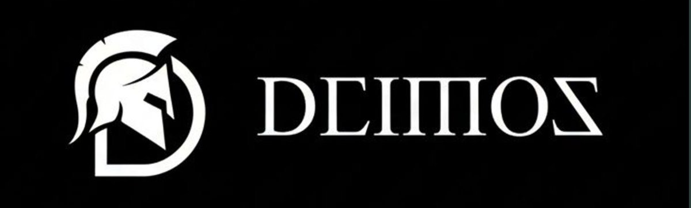

<p align="center">
  
</p>

# Deimos : Client-Side Mobile Benchmarking Suite

<p>
  <a href="https://deimos-werw.vercel.app/"></a>
  <a href="https://deimos-werw.vercel.app/docs"></a>
  <a href="https://deimos-werw.vercel.app/benchmarks"></a>
  <a href="https://deimos-werw.vercel.app/privacy"></a>
</p>

**Deimos** is an open-source suite for benchmarking zero-knowledge proving and verification on mobile devices. It combines a Flutter client, Rust proving backends, a benchmark API, and a public dashboard.

## Overview

Deimos measures proving and verification time, memory usage, CPU usage, proof size, and related device metrics across multiple proving systems and circuit families.

---

## Repository Structure

```
.
├── website/                         # Next.js dashboard and documentation
├── backend/                         # Benchmark API
│   ├── controllers/                 # Result ingestion and queries
│   ├── routes/                      # API routes
│   └── db/                          # PostgreSQL schema
├── benchmarking-suite/
│   ├── frameworks/
│   │   ├── groth16/                 # Circom/Groth16 circuits and inputs
│   │   ├── barretenberg/            # Noir/UltraHonk circuits
│   │   └── cairo-m/                 # Cairo-M circuits and compiled programs
│   └── moPro/                       # Rust workspace and mobile integration
│       ├── mopro-example-app/
│       │   ├── src/                 # Arkworks, Rapidsnark, Barretenberg, and FFI
│       │   └── flutter/              # Android/iOS app and IMP1 channel
│       ├── cairo-m-prover/          # Cairo-M prover library
│       ├── provekit-wrapper/         # ProveKit integration
│       └── risc0-circuit/           # RISC Zero guest and host
├── assets/                          # Repository assets
└── .github/workflows/               # CI workflows
```

## Supported Frameworks

| Framework | Proving system |
| --- | --- |
| Arkworks | Groth16 proving for Circom circuits |
| Rapidsnark | Groth16 proving for Circom circuits |
| Barretenberg | Noir circuits using UltraHonk |
| RISC Zero | zkVM guest and host |
| Cairo-M | STARK proving over the M31 field |
| IMP1 | Native mobile prover integration |
| ProveKit | Accelerated Noir proving |

## Circuit Families

The suite includes SHA-256, Keccak-256, Blake2s, Blake3, MiMC, Poseidon, Poseidon2, Rescue Prime, Pedersen, Anemoi, and a RISC Zero Factor program. Circuit availability varies by framework and input size.

## Getting Started

1. **Clone the repository**
   ```bash
   git clone https://github.com/BlocSoc-iitr/deimos.git
   git checkout dev
   cd deimos
   ```

2. **Run the dashboard**
   ```bash
   cd website
   npm install
   npm run dev
   ```

3. **Run the mobile app**
   ```bash
   cd benchmarking-suite/moPro/mopro-example-app/flutter
   flutter pub get
   flutter run
   ```

For Rust backends and platform-specific setup, see [benchmarking-suite/README.md](benchmarking-suite/README.md) and the [Flutter app README](benchmarking-suite/moPro/mopro-example-app/flutter/README.md).

## Contributing

Contributions are welcome through GitHub issues and pull requests.

## License

This project is licensed under the [MIT License](LICENSE).

---

*Building neutral, comprehensive benchmarks for mobile ZK proving.*
[](https://deepwiki.com/BlocSoc-iitr/Deimos)
